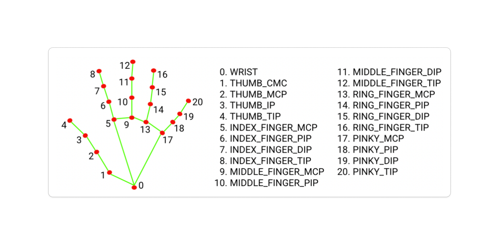

# Hand landmark and guesture recognition with UDP server

Simple handlandmark detection and gesture recognition using mediapipe in python

Also sets up a UDP server that you can get the data from

For a university project.

### Before running:

```
pip install mediapipe
```
```
pip install opencv-python
```
```
pip install python-osc
```

yeaaa i know I should probably setup a virtual envioronment for this lol (maybe laterrr)

To run:
```
python hand_recognition.py
```
Press q to quit

## UDP Server data format

There are 3 endpoints to get hand data from:

- ```/numHands -> [n]``` - Where ```n``` is an integer containing to number of hands currently being detected


- ```/gesture -> [g]```  - Where ```g``` is a string containing the name of the current gesture.
Possible names are ```"None", "Closed_Fist", "Open_Palm", "Pointing_Up", "Thumb_Down", "Thumb_Up", "Victory", "ILoveYou"```


- ```/<landmark name> -> [x, y, z]``` - Where ```x```, ```y``` and ```z``` are the screen space coordinates (normalised from 0 - 1000) of the hand landmark with a name of ```<landmark name>```.
e.g. ```/wrist``` would give you the coordinates of the wrist landmark.
Possible landmark names (use lowercase):

Image from: https://ai.google.dev/edge/mediapipe/solutions/vision/hand_landmarker